# fpa-close-pipeline

AI-assisted monthly reporting refresh with a pull-request human gate.
Built by **Shakil Ahmad, CFA** for an FP&A case study. **All data is fully
synthetic** (fictionalized case pack; period "May 2026").

**Live dashboard:** published via GitHub Pages from `docs/` after each
reviewed merge.

## The workflow

```mermaid
flowchart LR
    subgraph AUTO["AUTOMATED - refresh.py (deterministic numbers)"]
        S1["Stage 1 EXTRACT\nread Excel model\n(openpyxl, values only)"]
        S2["Stage 2 COMPUTE\nvariances + aggregates in Python\ncross-check ties to model to the $"]
        S3["Stage 3 GROUND\napproved-figures JSON payload\ninjected into ONE prompt template"]
        S4["Stage 4 NARRATE\nClaude API x2\n({{audience}} = bu_leader | cfo_board)\nLLM narrates, never computes"]
        S5["Stage 5 VALIDATE\nevery figure in output checked\nagainst payload; FAIL withholds\nnarrative from dashboard"]
        S6["Stage 6 PUBLISH\nrender docs/index.html\nappend runs/run_log.jsonl"]
        S1 --> S2 --> S3 --> S4 --> S5 --> S6
    end
    subgraph HUMAN["HUMAN GATE - GitHub"]
        H1["git branch + commit\n(run outputs + evidence)"]
        H2["Pull request\nreviewer checks narrative vs\nTie-Out tab of the model"]
        H3["Approve & merge\n= documented sign-off"]
        H4["GitHub Pages deploys\ndashboard link for leadership"]
        H1 --> H2 --> H3 --> H4
    end
    S6 --> H1
```



Tools at the steps that matter: **openpyxl/Python** (Stages 1–2, all arithmetic),
**Anthropic Claude API** (Stage 4, narration only), **regex validator** (Stage 5),
**GitHub PR review** (the human approval), **GitHub Pages** (distribution).

## Controls (who stands behind the numbers)

| Control | Where | What it prevents |
|---|---|---|
| Deterministic math | Stages 1–2 | LLM never does arithmetic |
| Model cross-check | Stage 2 (aborts on mismatch) | script drifting from the Excel a reviewer opens |
| Grounded prompt | Stage 3 + `prompts/commentary_prompt.txt` | figures invented outside the payload |
| Figure validator | Stage 5 | any ungrounded number reaching the dashboard |
| PR review & merge | GitHub | publication without documented human sign-off |
| Run log | `runs/run_log.jsonl` | silent re-runs; every execution is on the record |

## Run it

```bash
pip install -r requirements.txt
export ANTHROPIC_API_KEY=...        # Windows PowerShell: $env:ANTHROPIC_API_KEY="..."
python refresh.py                   # guardrail ON  (production mode)
python refresh.py --guardrail off   # naive mode: model computes figures itself
                                    # (kept once as the caught-error exhibit)
python refresh.py --dry-run         # plumbing test, no API call
```

Evidence per run: `runs/<run_id>_<audience>.json` (full API request + response,
timestamp, model, token usage) and one line in `runs/run_log.jsonl`.

## Repo layout

```
refresh.py                    the pipeline (stages match the diagram)
prompts/commentary_prompt.txt the single wired prompt ({{audience}}, {{payload_json}})
model/*.xlsx                  the live-formula Excel model (source of truth)
runs/                         execution evidence + run log
docs/index.html               the published dashboard (GitHub Pages)
```
